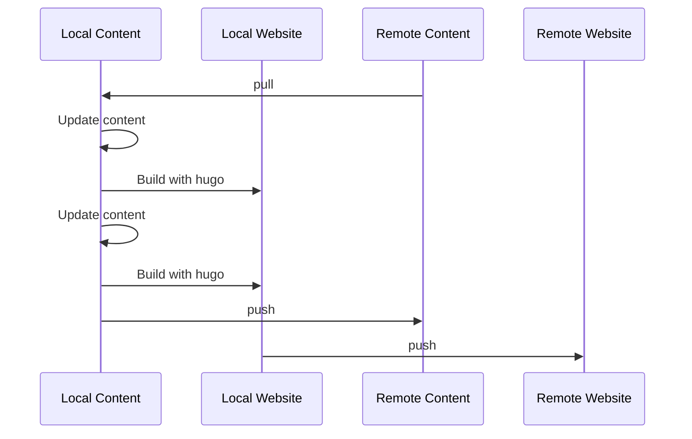
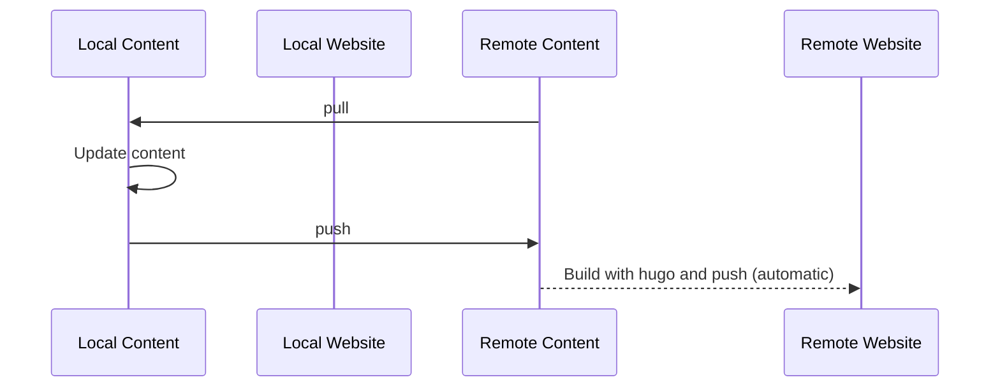

---
# Course title, summary, and position.
linktitle: Creating and hosting your personal website
summary: Creating and hosting your personal website
weight: 1

# Page metadata.
title: Creating and hosting your personal website
date: "2018-09-09T00:00:00Z"
lastmod: "2018-09-09T00:00:00Z"
draft: false  # Is this a draft? true/false
toc: true  # Show table of contents? true/false
type: docs  # Do not modify.
author: [simon]

# Add menu entry to sidebar.
# - name: Declare this menu item as a parent with ID `name`.
# - weight: Position of link in menu.
menu:
  website:
    name: Creating and hosting your personal website
    weight: 1
    

# for math
#markup: mmark
---

**Goal**

- Personal websites that are **easy to create and maintain**
- Yet **flexible and beautiful**
- Free

**Two frameworks**
- `hugo` and `jekyll`
- Static sites generators
- Content written in `Markdown`, some configuration in `YAML`
- Build the corresponding `html` pages
- Various themes for your applications
  - blogs, portfolios, research group, résumé, project documentation, etc.

**Hosting**
- GitHub Pages
- Automatic build with GitHub Actions

**We want to avoid**
- writing html
- lots of manipulations to update your website


# Hugo and Academic theme with GitHub Actions

See [demo website](https://academic-demo.netlify.app/)

Structure:
- front page organized in widgets
- excellent management for publications, talks, etc
  - tags, projects, sorting, featured, links, etc.

allows math without any work

Other [themes](https://themes.gohugo.io/): lots for blogging, project docs; see also [Resume](https://themes.gohugo.io/themes/hugo-resume/), [Avicenna](https://themes.gohugo.io/themes/avicenna/) and the Academic variations ([Résumé](https://github.com/wowchemy/starter-hugo-academic),  [Research Group](https://github.com/wowchemy/starter-hugo-research-group), [Online course](https://github.com/wowchemy/starter-hugo-online-course))


## Setting up Hugo

[See this guide](https://wowchemy.com/docs/getting-started/install-hugo-extended/)

## Setting up Git, GitHub and local repository

([Inspired from this guide](https://wowchemy.com/docs/hugo-tutorials/deployment/#github-pages))

[Install git](https://help.github.com/articles/set-up-git/)

We will create two repos:

- `some-name`: will hold *content* (Md, YAML, reference to theme); should be a fork of the [Academic theme](https://github.com/wowchemy/starter-hugo-academic#fork-destination-box)
- `<your-username>.github.io`: will hold the actual website (html, css, js)


Clone locally and initialize submodules (reference to theme)

```
git clone https://github.com/<USERNAME>/my-wowchemy-site.git My_Website
cd My_Website
git submodule update --init --recursive
```

Add the build repo as a submodule to the content repo:

```
git submodule add -f -b master https://github.com/<USERNAME>/<USERNAME>.github.io.git public
```
You'll probably get some warnings, you can ignore them.


## First build


Change base URL in `config/_default/config.yaml`

```
baseurl = "https://<USERNAME>.github.io/"
```

Serve locally

```
hugo server
```

Check your website at the address privided (e.g., http://localhost:1313/)

First build

```
hugo
```
Now check that `public` has been populated

## Deploy to GitHub

From the content local repo, commit and push (this only pushes the content):

```
git add .
git commit -m "Initial commit"
git push -u origin master
```


Then push the built website
```
cd public
git add .
git commit -m "First build"
git push origin master
cd ..
```

Check out the remote repo

Wait for GitHub to apply changes, and check out your new website!
```
<USERNAME>.github.io
```

## Update workflow

To get any cahnge on the website, you need to update the remote repo `<USERNAME>.github.io`; changing the remote content repo will do nothing. Here are two approahces:

### Local build, push both



### Automatic deployment

With proper automatization, updating can be as simple as:

In particular, you don't even need `hugo` on your machine, only `git`!

This also allows to edit directly on GitHub (useful for typos and small updates!). Don't forget to pull locally, though!

([Based on this tutorial](https://discourse.gohugo.io/t/deploy-hugo-project-to-github-pages-with-github-actions/20725))

To achieve this, we need to use GitHub Actions. 

First, we need to create a public/private key pair ([see this guide](https://github.com/marketplace/actions/github-pages-action#%EF%B8%8F-create-ssh-deploy-key))

```
ssh-keygen -t rsa -b 4096 -C "$(git config user.email)" -f gh-pages -N ""
# You will get 2 files:
#   gh-pages.pub (public key)
#   gh-pages     (private key)
```

Go to repository settings:
- In build repo: Go to Deploy Keys and add your public key with `Allow write access`
- In content repo: Go to Secrets and add your private key as `ACTIONS_DEPLOY_KEY`


In the `/.github/workflows/` folder of the content repo, add the following `gh-pages.yml` file (can also be done in the Actions tab on the GitHub website):

```yaml
name: GitHub Pages with Hugo

on:
  push:
    branches:
    - master

jobs:
  build-deploy:
    runs-on: ubuntu-latest
    steps:
    - uses: actions/checkout@v2

    - name: Setup Hugo
      uses: peaceiris/actions-hugo@v2
      with:
        hugo-version: 'latest'
        extended: true

    - uses: actions/cache@v2
      with:
        path: /tmp/hugo_cache
        key: ${{ runner.os }}-hugomod-${{ hashFiles('**/go.sum') }}
        restore-keys: |
          ${{ runner.os }}-hugomod-

    - name: Build
      run: hugo --minify

    - name: Deploy
      uses: peaceiris/actions-gh-pages@v3
      with:
        deploy_key: ${{ secrets.ACTIONS_DEPLOY_KEY }}
        external_repository: fontaine618/fontaine618.github.io
        publish_branch: main
        publish_dir: ./public
```

## Hugo Academic and BibTeX

Creating content may be long, especially if you have many publications (one file per publications and requires to fill in entries). Fortunately, there exist a tool taking a `.bib` file doing everything for you:

[See this tutorial](https://pypi.org/project/academic/)

## Customization

See the [documentation](https://wowchemy.com/docs/)

# Jekyll and GitHub Pages

Jekyll works very similarly to hugo, but has slightly better GitHub Actions support by the community. Templates are generally simpler than Academic Hugo, however.

## Preparation

- Satisfy all [requirements](https://jekyllrb.com/docs/installation/#requirements)
- Select a [template](https://github.com/topics/jekyll-theme): we will use [al-folio](https://github.com/alshedivat/al-folio) as it has a nice publications features. (see the [github repo](https://github.com/alshedivat/al-folio#user-community) for examples and features)
- Fork the [repo](https://github.com/alshedivat/al-folio)
- Rename to `<USERNAME>.github.io`

## Local build

Clone, install and build:
```
git clone https://github.com/<USERNAME>/<USERNAME>.github.io.git
cd <USERNAME>.github.io
bundle install
bundle exec jekyll serve
```

You can check out your *local* website at the specified address (e.g., http://127.0.0.1:4000/)
- like `hugo` the `serve` command listens to changes so it will dynamically update!

## Deploy on GitHub Pages

In `_config.yml`, change `url` to 

```
url: https://<USERNAME>.github.io/
```

and set `baseurl` to nothing

```
baseurl: 
```

Commit and push your website

On the GitHub website:
- Actions > Enable GitHub Actions (the `al-folio` comes with Actions!)
- Repository settings > Pages > set branch to `gh-pages`

Wait for GitHub to apply changes, and check out your new website!
```
<USERNAME>.github.io
```


Other templates may not have built-in actions, you can look at  [this tutorial](https://jekyllrb.com/docs/continuous-integration/github-actions/) (note that you no longer need to create the `GITHUB_TOKEN`).
